# Flow Sistem NutriFit

Dokumen ini menjelaskan alur sistem berdasarkan implementasi aplikasi yang ada saat ini. Sistem berjalan sebagai aplikasi web **Python + Streamlit** untuk mengelola profil user, menghitung kebutuhan nutrisi, menampilkan riwayat hitung kalori, serta memberi rekomendasi menu makanan dan latihan gym.

## 1. Gambaran Umum

NutriFit memiliki dua jenis data utama:

- **Dataset referensi**: data anggota gym, nutrisi makanan, dan program latihan. Dataset ini dibaca dari tabel SQL yang dibuat dari CSV.
- **Data aplikasi/user**: akun user, riwayat hitung kalori, riwayat rekomendasi menu, dan riwayat rekomendasi latihan. Data ini memakai JSON sebagai storage default, dengan opsi memakai MySQL/PostgreSQL lewat konfigurasi `.env`.

Pendekatan rekomendasi yang berjalan di kode:

- **K-Means** untuk memberi label cluster makanan berdasarkan `calories`, `proteins`, `fat`, dan `carbohydrate`.
- **Content-Based Filtering (TF-IDF + cosine similarity)** untuk ranking makanan berdasarkan preferensi user.
- **K-Prototypes runtime** untuk menentukan cluster user dari dataset `gym_members` dengan gabungan jarak numerik dan kategorikal.
- **Content-Based Filtering** untuk ranking latihan berdasarkan target otot, jenis latihan, alat, dan level pengalaman.
- **Rule-based constraints** untuk distribusi kalori per slot makan, gramasi makanan, keamanan level latihan, variasi equipment, serta parameter set/reps/rest.

## 2. Aktor Sistem

| Aktor | Hak Akses |
| --- | --- |
| User | Registrasi, login, edit profile, melihat dashboard Home, menghitung kalori, menghapus transaksi kalori miliknya, membuat/tukar rekomendasi menu, dan membuat rekomendasi latihan. |
| Admin | Semua akses user ditambah halaman Admin Data untuk inspeksi user, record kalori, record menu, record latihan, dataset gym member, dataset makanan, dataset latihan, serta menghapus user/record aplikasi. |

## 3. Struktur Data dan Storage

### 3.1 Dataset Referensi SQL

Dataset referensi di-import dari CSV memakai `schema_data/import_csv_to_db.py`.

| Tabel | Sumber CSV | Dipakai Untuk |
| --- | --- | --- |
| `gym_members` | `data/gym_members.csv` | Referensi cluster/profil user. |
| `food_nutrition` | `data/food_nutrition.csv` | Kandidat rekomendasi makanan. |
| `training_program` | `data/training_program.csv` | Kandidat rekomendasi latihan. |

Catatan penting: fungsi `load_datasets()` saat ini membaca dataset referensi dari database SQL. Jika SQL tidak aktif, fungsi dataset akan gagal dengan pesan bahwa dataset source adalah database-only.

### 3.2 Data Aplikasi

Data aplikasi dikelola oleh `src/database.py`.

| Store | File JSON Default | Tabel SQL Opsional | Isi |
| --- | --- | --- | --- |
| User | `database/user.json` | `users` | Akun, role, tanggal lahir, gender, snapshot profile/nutrition terbaru. |
| Kalori | `database/calorie.json` | `calorie_records` | Riwayat hasil kalkulator kalori. |
| Menu | `database/meal_recommendation.json` | `meal_recommendations` | Riwayat rekomendasi menu. |
| Latihan | `database/workout_recommendation.json` | `workout_recommendations` | Riwayat rekomendasi latihan. |

Mode database dipilih dari `.env`:

```env
MYSQL=true
POSTGRES=false
```

atau:

```env
MYSQL=false
POSTGRES=true
```

Jika tidak memakai SQL untuk data aplikasi, sistem membuat file JSON default.

## 4. Arsitektur Runtime

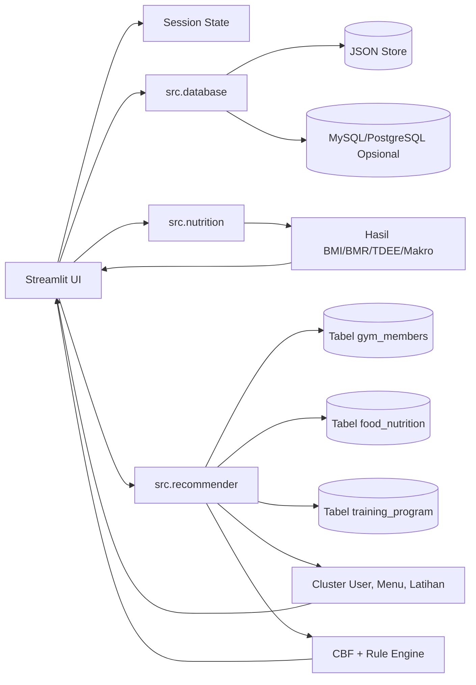

## 5. Navigasi Aplikasi

Saat belum login:

- `Login`
- `Register`

Saat sudah login:

- `Home`
- `Profile`
- `Hitung Kalori`
- `Rekomendasi Menu`
- `Rekomendasi Latihan`
- `Admin Data` hanya untuk role `admin`

## 6. Flow Autentikasi

### 6.1 Register

Input:

- Nama lengkap
- Email
- Password
- Konfirmasi password
- Tanggal lahir
- Gender
- Persetujuan terms

Validasi:

- Nama, email, dan password wajib diisi.
- Password dan konfirmasi password harus sama.
- Email tidak boleh sudah terdaftar.
- Terms harus disetujui.

Flow:

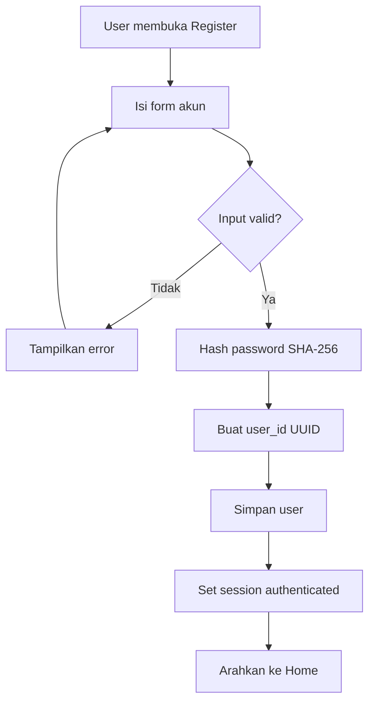

### 6.2 Login

Flow:

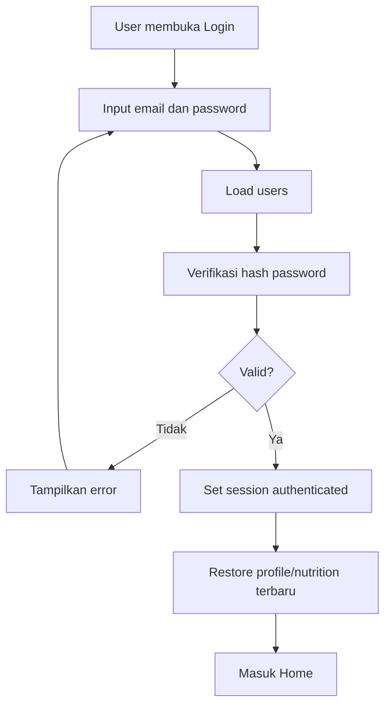

Saat login berhasil, sistem memanggil `restore_user_context()`. Jika ada record terbaru di `calorie_records`, record itu menjadi sumber `profile` dan `nutrition` aktif. Jika belum ada, sistem memakai snapshot di data user.

## 7. Flow Profile

Halaman `Profile` memungkinkan user mengedit informasi akun saat ini.

Field yang bisa diedit:

- Nama lengkap
- Tanggal lahir
- Jenis kelamin
- Password baru opsional

Field email ditampilkan tetapi tidak dapat diedit agar relasi record lama tetap konsisten.

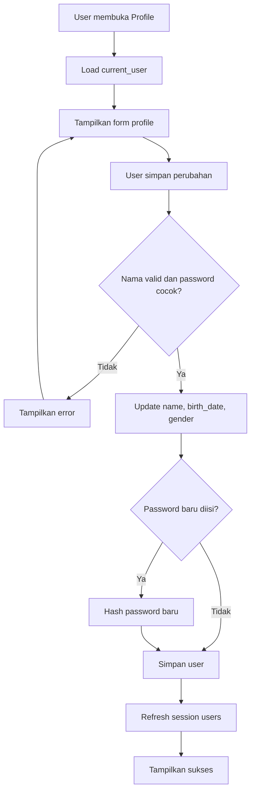

## 8. Flow Home Dashboard

Home menampilkan ringkasan user aktif:

- Sapaan dan role.
- **Tren Berat Badan** dari `calorie_records`.
- Aktivitas terakhir berdasarkan state rekomendasi.
- Rasio makro hari ini.
- Target kalori hari ini.
- Fakta kesehatan.

### 8.1 Tren Berat Badan

Data chart:

- Sumbu X: `created_at` dari `calorie_records`.
- Sumbu Y: `profile.weight_kg`.
- Data difilter berdasarkan `user_id`.
- Chart memakai Altair dengan garis merah, titik bulat, dan tooltip berisi tanggal serta berat.

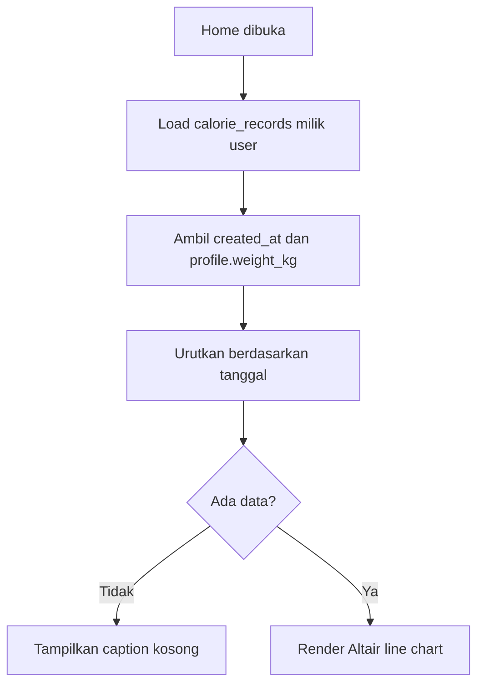

## 9. Flow Hitung Kalori

Halaman `Hitung Kalori` menghitung kebutuhan nutrisi berdasarkan data fisik dan tujuan user.

Input:

- Berat badan
- Tinggi badan
- Jenis kelamin
- Tingkat aktivitas: `Low`, `Medium`, `High`, `Very High`
- Usia
- Level pengalaman: `Beginner`, `Intermediate`, `Expert`
- Tujuan: `Lose Weight`, `Maintain Weight`, `Gain Weight`

Rumus utama:

```text
BMI = weight_kg / (height_m ^ 2)

BMR laki-laki = 10 * weight_kg + 6.25 * height_cm - 5 * age + 5
BMR perempuan = 10 * weight_kg + 6.25 * height_cm - 5 * age - 161

TDEE = BMR * activity_factor
target_calories = max(1200, TDEE + goal_adjustment)
```

Activity factor:

| Aktivitas | Nilai |
| --- | ---: |
| Low | 1.2 |
| Medium/Moderate | 1.375 |
| High | 1.55 |
| Very High | 1.725 |

Goal adjustment:

| Tujuan | Adjustment |
| --- | ---: |
| Lose Weight | -400 kcal |
| Maintain Weight | 0 kcal |
| Gain Weight | +350 kcal |

Makro harian:

- Karbohidrat: 50% dari target kalori / 4.
- Protein: 25% dari target kalori / 4.
- Lemak: 25% dari target kalori / 9.

Flow:

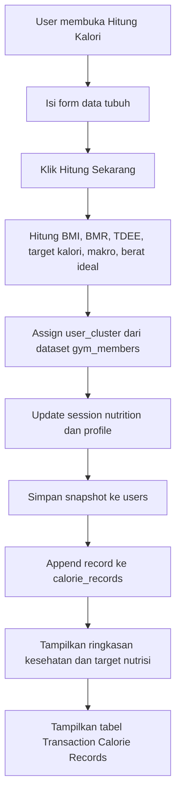

### 9.1 Assignment Cluster User

Implementasi sekarang memakai K-Prototypes runtime terhadap dataset `gym_members`:

1. Ambil fitur numerik `Age`, `Weight (kg)`, `Height (m)`, dan `BMI`.
2. Ambil fitur kategorikal `Gender`, `Activity_Level`, `Experience_Label`, dan `Fitness_Goal`.
3. Normalisasi fitur numerik dengan `MinMaxScaler`.
4. Jalankan iterasi K-Prototypes:
   - jarak numerik dihitung dari selisih kuadrat fitur numerik;
   - jarak kategorikal dihitung dari jumlah mismatch kategori;
   - centroid numerik diperbarui dengan mean;
   - prototype kategorikal diperbarui dengan mode.
5. Profil user baru ditransformasikan ke ruang fitur yang sama.
6. User dialokasikan ke prototype dengan combined cost terkecil.

### 9.2 Tabel Transaction Calorie Records

Setiap hasil hitung kalori disimpan sebagai row baru di `calorie_records`.

Kolom yang ditampilkan:

- Tanggal
- Berat
- BMI
- Target kalori
- Protein
- Tujuan
- Aksi hapus

Jika user menghapus row:

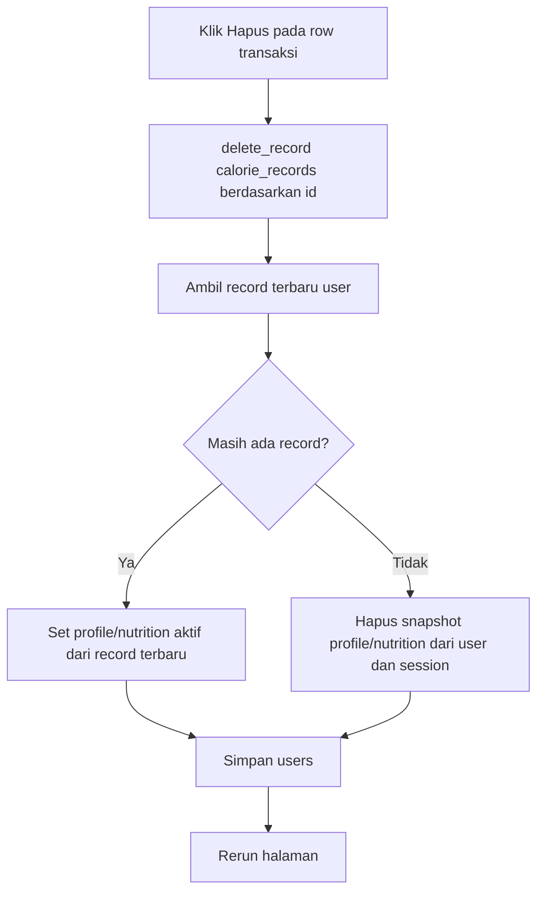

## 10. Flow Rekomendasi Menu

Halaman `Rekomendasi Menu` hanya dapat digunakan jika user sudah menghitung target nutrisi. Jika belum, sistem menampilkan tombol untuk membuka `Hitung Kalori`.

### 10.1 Persiapan Dataset Makanan

Saat dataset dimuat:

1. Ambil `food_nutrition` dari SQL.
2. Bersihkan row tanpa `name`, `calories`, `proteins`, `fat`, atau `carbohydrate`.
3. Ubah kolom numerik ke tipe numerik.
4. Buang makanan dengan kalori `<= 0`.
5. Bentuk teks `CBF_Text` dari nama, nutrisi, dan cluster.
6. Jalankan K-Means dengan `n_clusters=3`.
7. Map cluster menjadi label `A`, `B`, `C` berdasarkan rata-rata nutrisi:
   - Cluster kalori terendah menjadi `C`.
   - Di luar itu, cluster protein tertinggi menjadi `B`.
   - Sisanya menjadi `A`.

### 10.2 Distribusi Menu

Distribusi target kalori:

| Slot | Label UI | Proporsi |
| --- | --- | ---: |
| `Breakfast` | Sarapan | 25% |
| `Lunch` | Makan Siang | 35% |
| `Snack` | Camilan | 10% |
| `Dinner` | Makan Malam | 30% |

Template cluster:

| Slot | Cluster |
| --- | --- |
| Breakfast | A + B |
| Lunch | A + B + B + C |
| Snack | C |
| Dinner | B + C |

### 10.3 Generate Menu

Input user:

- Preferensi makanan dari multiselect.
- Jika kosong, query fallback adalah `balanced protein carbohydrate vegetable`.

Flow:

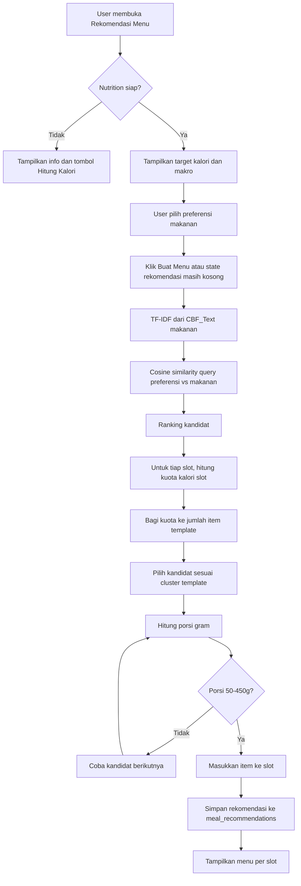

Rumus porsi:

```text
portion_gram = (target_calories_item / calories_per_100g) * 100
```

Constraint:

- Kandidat utama harus punya kalori `> 0`.
- Porsi valid berada pada rentang 50 sampai 450 gram.
- Jika kandidat cluster template tidak ada yang valid, sistem fallback ke kandidat ranking umum yang belum dipakai.

### 10.4 Tukar Menu

Tiap item rekomendasi memiliki tombol `Tukar`.

Flow:

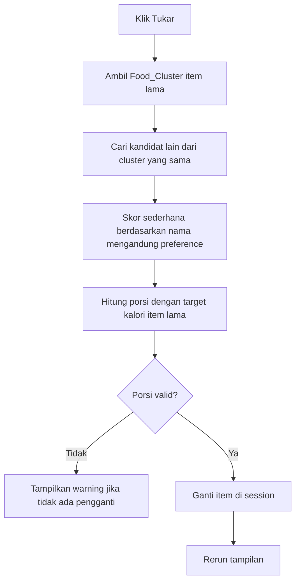

Catatan: hasil swap saat ini mengganti item di session display. Record rekomendasi awal sudah tersimpan saat generate.

## 11. Flow Rekomendasi Latihan

Halaman `Rekomendasi Latihan` juga membutuhkan nutrition/profile aktif. Jika belum ada, user diarahkan ke kalkulator kalori.

### 11.1 Persiapan Dataset Latihan

Saat dataset dimuat:

1. Ambil `training_program` dari SQL.
2. Bersihkan atribut penting seperti `Title`, `Desc`, `Type`, `BodyPart`, `Equipment`, dan `Level`.
3. Normalisasi level pengalaman.
4. Bentuk `CBF_Text` dari atribut latihan.
5. Buat `Exercise_Cluster` dengan K-Modes-style clustering berbasis mismatch kategorikal dan mode tiap cluster.

### 11.2 Safety Level

| Level User | Latihan yang Boleh Muncul |
| --- | --- |
| Beginner | Beginner |
| Intermediate | Beginner, Intermediate |
| Expert | Beginner, Intermediate, Expert |

### 11.3 Parameter Latihan

| Tujuan | Beginner | Intermediate | Expert |
| --- | --- | --- | --- |
| Lose Weight | 3 set x 15 reps, rest 60s | 4 set x 15 reps, rest 60s | 4 set x 20 reps, rest 45s |
| Gain Weight | 3 set x 10 reps, rest 90s | 4 set x 10 reps, rest 90s | 4 set x 12 reps, rest 90s |
| Maintain Weight | 3 set x 12 reps, rest 75s | 3 set x 12 reps, rest 75s | 4 set x 12 reps, rest 75s |

### 11.4 Generate Latihan

Input user:

- Target otot/body part.
- Jenis latihan/type.
- Alat/equipment.
- Jumlah latihan 3 sampai 8.

Flow:

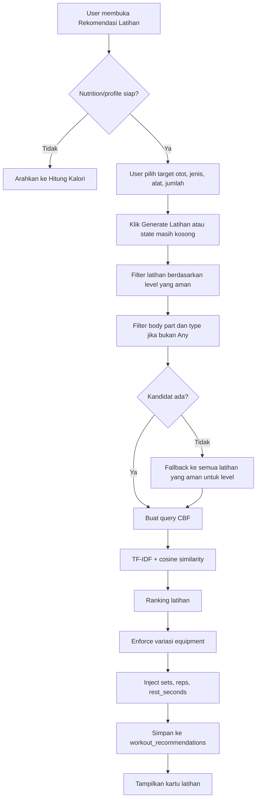

Output kartu latihan:

- Nomor urutan.
- Nama gerakan.
- Body part.
- Equipment.
- Level.
- Deskripsi.
- Sets, reps, dan rest.

## 12. Flow Admin Data

Halaman `Admin Data` hanya dapat dibuka oleh user dengan role `admin`.

Tab yang tersedia:

- `Registered Users`
- `Calorie Data`
- `Meal Data`
- `Workout Data`
- `Performa Model`
- `Gym Members`
- `Food Dataset`
- `Workout Dataset`

### 12.1 Admin Users

Admin dapat melihat daftar user dengan status apakah user memiliki data kalori dan snapshot profile. Admin juga dapat menghapus user non-admin selain dirinya sendiri.

Jika user dihapus:

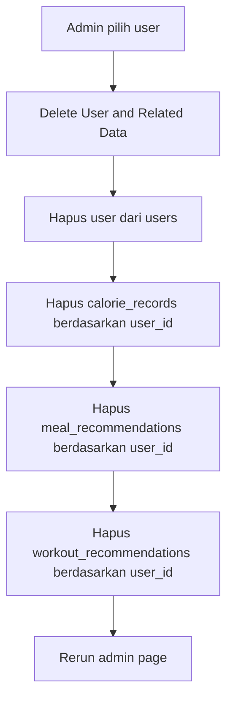

### 12.2 Admin Records

Admin dapat melihat ringkasan record kalori, menu, dan latihan. Admin dapat menghapus record berdasarkan `id`.

### 12.3 Dataset Tabs

Admin dapat melihat dan mengelola dataset referensi:

- Gym members ditampilkan sebagai tabel inspeksi.
- Food dataset dapat ditambah, diubah, dan dihapus dari UI admin jika SQL aktif.
- Workout dataset dapat ditambah, diubah, dan dihapus dari UI admin jika SQL aktif.

Setelah data makanan atau latihan diubah, cache dataset dibersihkan sehingga K-Means/K-Modes-style clustering dan TF-IDF runtime dibangun ulang pada load berikutnya.

### 12.4 Performa Model

Tab `Performa Model` menampilkan evaluasi clustering dataset aktif:

| Model | Data | Metrik |
| --- | --- | --- |
| K-Prototypes | Profil anggota gym campuran | jumlah data, jumlah cluster, Combined Cost, silhouette score, distribusi cluster |
| K-Means | Menu makanan numerik | jumlah data, jumlah cluster, inertia, silhouette score, distribusi cluster |
| K-Modes | Latihan kategorikal | jumlah data, jumlah cluster, Hamming Cost, silhouette score, distribusi cluster |

Tombol `Refresh Performa Model` membersihkan cache dataset dan menghitung ulang performa dari data SQL terbaru.

## 13. Modul Implementasi

Struktur aktual project:

```text
app.py
src/
  database.py
  nutrition.py
  recommender.py
schema_data/
  import_csv_to_db.py
  import_json_to_db.py
database/
  user.json
  calorie.json
  meal_recommendation.json
  workout_recommendation.json
data/
  gym_members.csv
  food_nutrition.csv
  training_program.csv
```

Peran modul:

| Modul | Peran |
| --- | --- |
| `app.py` | UI Streamlit, routing halaman, session state, dan event handler. |
| `src/database.py` | Abstraksi storage JSON/SQL, schema SQL, load/save/append/delete record. |
| `src/nutrition.py` | Kalkulasi BMI, BMR, TDEE, target kalori, berat ideal, dan makro. |
| `src/recommender.py` | Load dataset SQL, cleaning dataset, cluster makanan, rekomendasi makanan, swap makanan, rekomendasi latihan. |
| `schema_data/import_csv_to_db.py` | Import dataset CSV ke SQL. |
| `schema_data/import_json_to_db.py` | Migrasi data JSON aplikasi ke SQL. |

## 14. Diagram Sistem

### 14.1 ERD

ERD berikut menggambarkan relasi data aplikasi dan dataset referensi yang dipakai oleh proses rekomendasi.

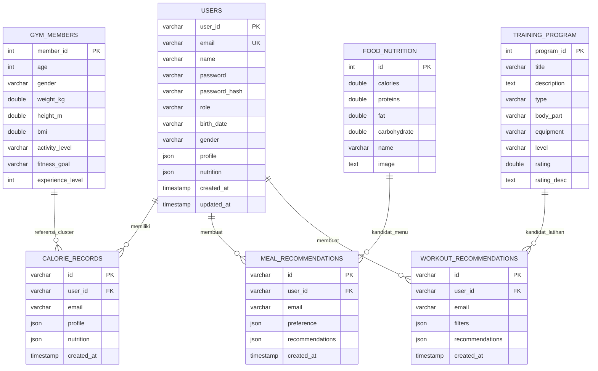

### 14.2 Sequence Diagram

Sequence berikut merangkum alur utama dari login, hitung kalori, generate menu, sampai generate latihan.

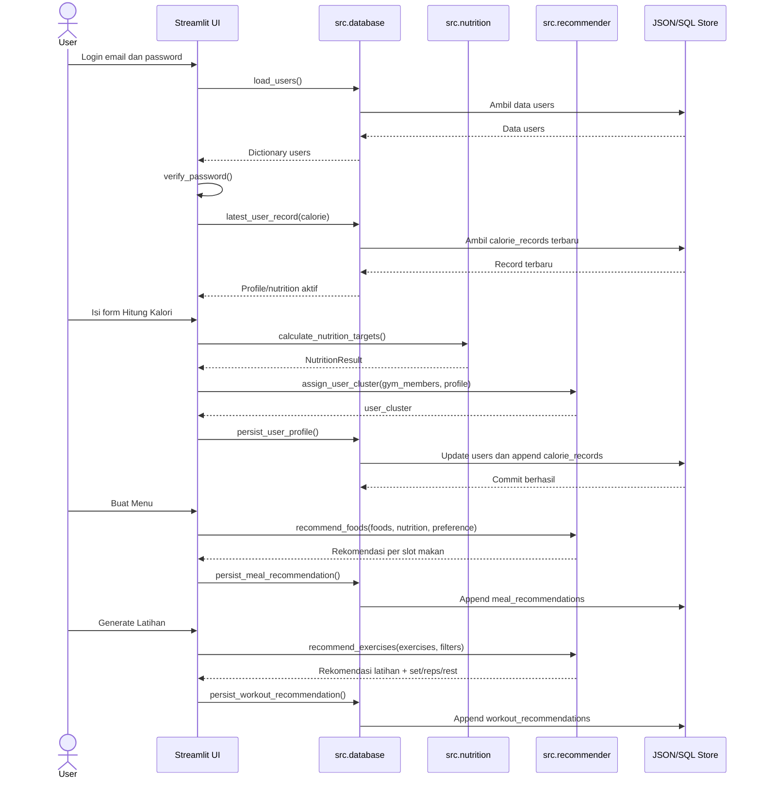

### 14.3 Class Diagram

Class diagram berikut menunjukkan struktur class/data object dan dependensi fungsi utama pada implementasi.

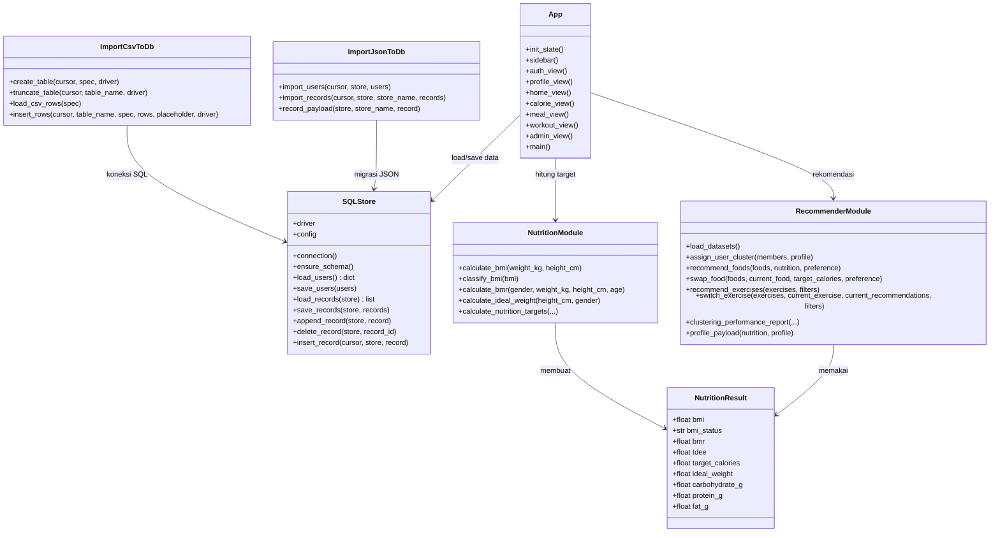

### 14.4 Diagram Database

Diagram ini memisahkan tabel aplikasi, tabel dataset referensi, dan metadata storage SQL.

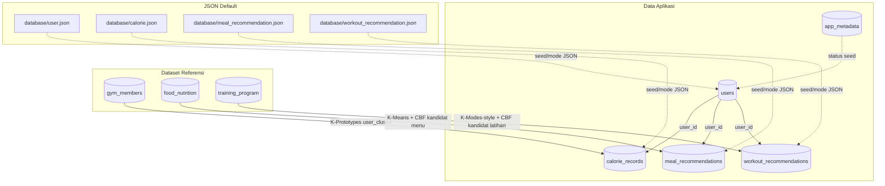

## 15. Skema SQL Aplikasi

Saat SQL dipakai untuk data aplikasi, `src/database.py` membuat tabel:

### 15.1 `users`

| Field | Keterangan |
| --- | --- |
| `user_id` | Primary key UUID. |
| `email` | Email unik. |
| `name` | Nama user. |
| `password` | Hash password SHA-256 pada implementasi saat ini. |
| `password_hash` | Field kompatibilitas password hash lama. |
| `role` | `user` atau `admin`. |
| `birth_date` | Tanggal lahir string ISO. |
| `gender` | `Male` atau `Female`. |
| `profile` | JSON snapshot profile terbaru. |
| `nutrition` | JSON snapshot nutrition terbaru. |
| `created_at` | Waktu dibuat. |
| `updated_at` | Waktu diperbarui. |

### 15.2 `calorie_records`

| Field | Keterangan |
| --- | --- |
| `id` | Primary key UUID. |
| `user_id` | Pemilik record. |
| `email` | Email pemilik saat record dibuat. |
| `profile` | JSON profil hasil hitung. |
| `nutrition` | JSON hasil nutrisi. |
| `created_at` | Waktu transaksi hitung kalori. |

### 15.3 `meal_recommendations`

| Field | Keterangan |
| --- | --- |
| `id` | Primary key UUID. |
| `user_id` | Pemilik record. |
| `email` | Email pemilik. |
| `preference` | JSON/list preferensi makanan. |
| `recommendations` | JSON hasil rekomendasi per slot makan. |
| `created_at` | Waktu generate menu. |

### 15.4 `workout_recommendations`

| Field | Keterangan |
| --- | --- |
| `id` | Primary key UUID. |
| `user_id` | Pemilik record. |
| `email` | Email pemilik. |
| `filters` | JSON filter latihan yang dipilih. |
| `recommendations` | JSON list latihan. |
| `created_at` | Waktu generate latihan. |

## 16. Output Sistem

Output untuk user:

- Dashboard Home dengan tren berat badan, ringkasan target, rasio makro, dan aktivitas.
- Halaman Profile untuk edit data akun.
- Ringkasan hasil kalkulasi: BMI, BMR, TDEE, berat ideal, target kalori, karbohidrat, protein, lemak, dan cluster user.
- Tabel transaksi kalori yang bisa dihapus per row.
- Rekomendasi menu per slot makan dengan gambar, cluster, kalori target, porsi, protein, lemak, dan karbohidrat.
- Tombol `Tukar` untuk mengganti item menu dari cluster yang sama.
- Rekomendasi latihan berupa kartu gerakan, target otot, alat, level, deskripsi, set, reps, dan rest.

Output untuk admin:

- Daftar user dan status data.
- Aksi hapus user beserta data terkait.
- Ringkasan record kalori/menu/latihan dan aksi hapus record.
- Performa model clustering K-Prototypes, K-Means, dan K-Modes.
- Tampilan dataset gym member, makanan, dan latihan.

## 17. Skenario Pengujian Minimum

| No | Skenario | Ekspektasi |
| ---: | --- | --- |
| 1 | Register dengan data valid | User dibuat, password tersimpan dalam bentuk hash, session login aktif, masuk Home. |
| 2 | Register email duplikat | Sistem menolak dan menampilkan error. |
| 3 | Login valid | Session aktif dan profile/nutrition terbaru direstore. |
| 4 | Edit Profile nama/gender/tanggal lahir | Data user berubah dan tersimpan. |
| 5 | Edit password dengan konfirmasi berbeda | Sistem menolak perubahan. |
| 6 | Hitung kalori dengan input valid | Hasil BMI/BMR/TDEE/makro tampil dan record baru tersimpan. |
| 7 | Hapus transaksi kalori terbaru | Record terhapus dan session memakai record terbaru berikutnya. |
| 8 | Hapus semua transaksi kalori | Snapshot profile/nutrition user dan session dikosongkan. |
| 9 | Home punya beberapa record berat | Trend line menampilkan titik, garis merah, dan tooltip tanggal/berat. |
| 10 | Rekomendasi menu tanpa nutrition | Sistem menampilkan info dan tombol ke Hitung Kalori. |
| 11 | Generate menu dengan preference | Menu per slot tampil mengikuti template cluster dan porsi valid. |
| 12 | Tukar menu | Item diganti dari cluster yang sama jika ada kandidat valid. |
| 13 | Generate latihan Beginner | Output hanya berisi latihan level Beginner. |
| 14 | Generate latihan dengan filter kosong hasilnya | Sistem fallback ke semua latihan aman untuk level user. |
| 15 | Admin hapus user non-admin | User dan record terkait hilang. |
| 16 | Admin hapus record aplikasi | Record dipilih terhapus berdasarkan id. |

## 18. Catatan Batasan Implementasi Saat Ini

- Dataset referensi harus tersedia di SQL; import CSV perlu dijalankan sebelum aplikasi dipakai.
- CRUD dataset referensi dari UI admin tersedia untuk makanan dan latihan; dataset gym member masih mode inspeksi/import CSV.
- Artefak model offline seperti file `.pkl` belum digunakan. K-Prototypes, K-Means, K-Modes-style clustering, dan TF-IDF dibuat saat runtime dari dataset SQL.
- Swap menu menyimpan ulang record rekomendasi dan menandai item pengganti dengan `is_swapped = true`.
- Beberapa label internal masih memakai bahasa Inggris untuk nilai data (`Male`, `Female`, `Beginner`, `Lose Weight`) karena dipakai oleh logic rekomendasi.
